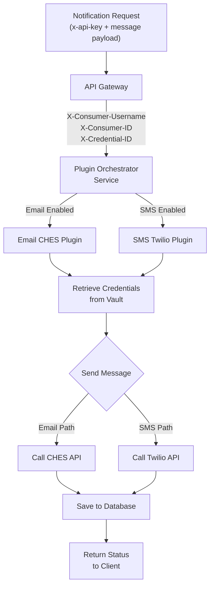
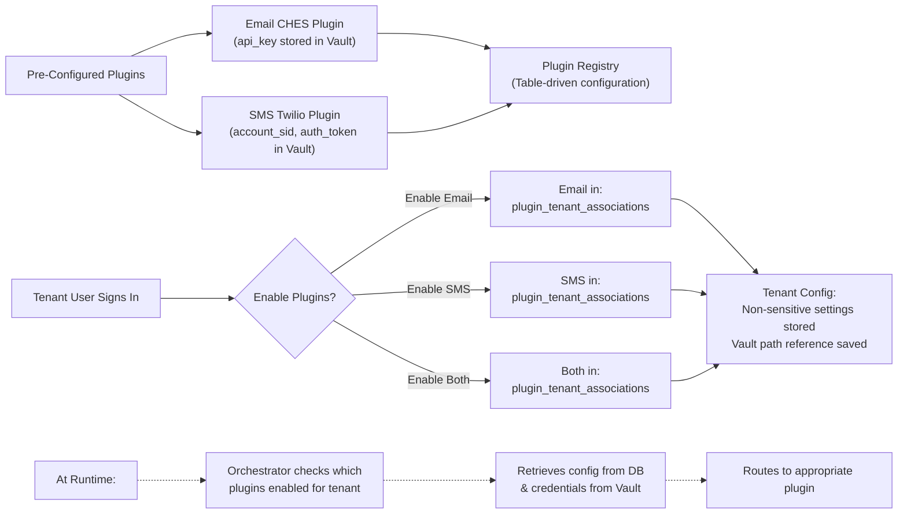
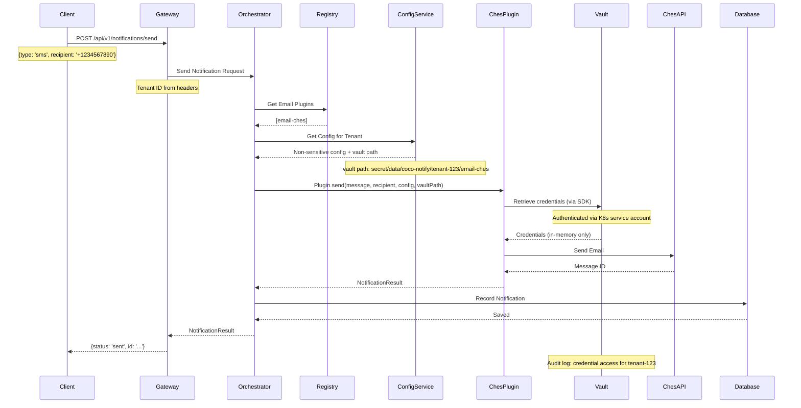
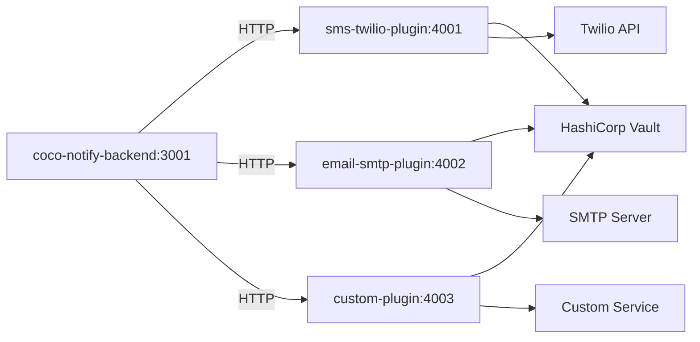

# Notification Plugin Architecture

## Overview

Provide built-in notification plugins (Email, SMS) that are pre-configured to connect to a default
email and sms provider (ches and twilio?) such that when users send notifications via Notify,
plugins are used to define how to send the notifications, and where required credentials are stored.
The plugins define what users need to supply, and validation rules that need to pass when
notifications are sent. This pattern will allow future development of plugins by external developers
by following the same plugin structure.

## Design Principles

- **Configuration-First**: Pre-Built plugins for email and sms
- **Tenant-Scoped**: Plugins are enabled per-tenant with independent configurations
- **Vault-Backed Secrets**: All sensitive credentials (SMTP passwords, API tokens, etc.) stored in
  HashiCorp Vault, never in database. Backend retrieves credentials on-demand when needed.

## Architecture Overview

### 1. Sending Notifications (Happy Path)



### 2. Plugin Configuration (Tenant Enablement)



**Note:** This diagram shows the default plugins for Phase 1 (Email CHES and SMS Twilio). Additional
pre-configured plugins may be added in the future. The Plugin Registry is a simple table in the
Notify database containing plugin metadata (id, name, type, configSchema, etc.).

## Core Components

### 1. Plugin Implementation (Internal)

Each built-in plugin is a service implementation handling a specific notification type.

```typescript
// Internal interface - not exposed to external developers (for now)
interface INotificationPlugin {
  // Plugin metadata
  id: string // Unique identifier (e.g., 'email-smtp')
  name: string // Display name (e.g., 'SMTP Email')
  type: NotificationType // 'email' | 'sms' | 'push' | 'webhook'
  version: string // Plugin version

  // Expected configuration shape (varies per plugin)
  configSchema: {
    fields: ConfigField[] // Name, type, validation rules
    required: string[] // Required field names
  }

  // Core functionality
  send(
    message: NotificationMessage,
    recipient: NotificationRecipient,
    config: Record<string, any>,
    metadata: NotificationMetadata,
  ): Promise<NotificationResult>

  // Health check
  healthCheck?(config): Promise<HealthCheckResult>
}
```

**Phase 1 Implementations:**

- Email via CHES (BC Gov's email service)
- SMS via Twilio

### 1. Plugin Config Service

- Manages plugin configurations per tenant
- Validates configuration before storing
- Tracks which plugins are enabled for each tenant
- Coordinates credential storage with HashiCorp Vault

**Responsibilities:**

- Save/retrieve non-sensitive plugin configs from database
- Store/retrieve sensitive credentials from HashiCorp Vault
- Enable/disable plugins per tenant
- Validate plugin configuration
- Maintain vault path references in database

### 2. Notification Orchestrator Service

- Receives send requests from tenant user
- Determines which plugin to use
- Retrieves plugin configuration for tenant
- Routes to correct plugin

**Flow:**



## Database Schema

### Plugins Table

```sql
CREATE TABLE plugins (
  id SERIAL PRIMARY KEY,
  plugin_id VARCHAR(255) UNIQUE NOT NULL,     -- 'email-smtp', 'sms-twilio'
  name VARCHAR(255) NOT NULL,                  -- 'SMTP Email'
  type VARCHAR(50) NOT NULL,                   -- 'email', 'sms', 'push'
  version VARCHAR(50) NOT NULL,                -- '1.0.0'
  description TEXT,
  config_schema JSONB NOT NULL,                -- ConfigField[] with validation rules
  status VARCHAR(50) NOT NULL,                 -- 'active', 'deprecated', 'disabled'
  service_url VARCHAR(500),                    -- For multi-service plugins
  created_at TIMESTAMP DEFAULT NOW(),
  updated_at TIMESTAMP DEFAULT NOW(),
  owner VARCHAR(255),                          -- E.g., 'bc-gov', 'external-team'
  documentation_url VARCHAR(500)
);
```

**Example Entries:**

```sql
-- Email CHES Plugin
INSERT INTO plugins (plugin_id, name, type, version, description, config_schema, status, owner, documentation_url)
VALUES (
  'email-ches',
  'Email via CHES',
  'email',
  '1.0.0',
  'Send emails through BC Gov Common Hosted Email Service',
  '{
    "fields": [
      {
        "name": "ches_api_endpoint",
        "type": "string",
        "label": "CHES API Endpoint",
        "required": true
      }
    ],
    "required": ["ches_api_endpoint"]
  }',
  'active',
  'bc-gov',
  'https://developer.gov.bc.ca/CHES'
);

-- SMS Twilio Plugin
INSERT INTO plugins (plugin_id, name, type, version, description, config_schema, status, owner, documentation_url)
VALUES (
  'sms-twilio',
  'SMS via Twilio',
  'sms',
  '1.0.0',
  'Send SMS messages through Twilio',
  '{
    "fields": [
      {
        "name": "twilio_from_number",
        "type": "string",
        "label": "Twilio From Number",
        "required": true,
        "validation": { "pattern": "^\\+[0-9]{1,15}$" }
      }
    ],
    "required": ["twilio_from_number"]
  }',
  'active',
  'bc-gov',
  'https://www.twilio.com/docs/sms'
);
```

### Plugin Tenant Associations Table

```sql
CREATE TABLE plugin_tenant_associations (
  id SERIAL PRIMARY KEY,
  tenant_id BIGINT NOT NULL REFERENCES tenants(id),
  plugin_id BIGINT NOT NULL REFERENCES plugins(id),
  enabled BOOLEAN DEFAULT true,
  configuration JSONB NOT NULL,                -- Non-sensitive config (field names, ports, etc)
  vault_path VARCHAR(500),                    -- Path in vault for sensitive credentials
  created_at TIMESTAMP DEFAULT NOW(),
  updated_at TIMESTAMP DEFAULT NOW(),
  UNIQUE(tenant_id, plugin_id)
);
```

### Notifications Table (Audit Trail)

```sql
CREATE TABLE notifications (
  id SERIAL PRIMARY KEY,
  notification_id VARCHAR(255) UNIQUE NOT NULL, -- Plugin-generated ID
  tenant_id BIGINT NOT NULL REFERENCES tenants(id),
  plugin_id BIGINT NOT NULL REFERENCES plugins(id),
  type VARCHAR(50) NOT NULL,                   -- 'email', 'sms'
  recipient VARCHAR(255) NOT NULL,             -- Email or phone
  subject VARCHAR(500),
  body_preview VARCHAR(500),
  status VARCHAR(50) NOT NULL,                 -- 'sent', 'pending', 'failed'
  result JSONB,                                -- Full plugin response
  error JSONB,                                 -- Error details if failed
  external_id VARCHAR(255),                    -- ID from external service
  created_at TIMESTAMP DEFAULT NOW(),
  updated_at TIMESTAMP DEFAULT NOW(),
  INDEX idx_tenant_created (tenant_id, created_at),
  INDEX idx_status (status)
);
```

## API Endpoints

### Admin Endpoints (for managing plugins)

#### Get Available Plugins

```
GET /api/v1/admin/plugins
Response:
[
  {
    "id": "email-ches",
    "name": "Email via CHES",
    "type": "email",
    "version": "1.0.0",
    "description": "Send emails via BC Gov's CHES service",
    "configSchema": { ... }
  },
  {
    "id": "sms-twilio",
    "name": "SMS via Twilio",
    "type": "sms",
    "version": "1.0.0",
    "description": "Send SMS messages via Twilio",
    "configSchema": { ... }
  }
]
```

#### Get Tenant's Plugin Configuration

```
GET /api/v1/admin/tenants/:tenantId/plugins
Response:
[
  {
    "pluginId": "email-smtp",
    "enabled": true,
    "configuration": { "smtp_host": "...", "from_address": "..." },
    "createdAt": "2026-04-01T...",
    "status": "configured"
  },
  {
    "pluginId": "sms-twilio",
    "enabled": false,
    "configuration": null,
    "createdAt": null,
    "status": "not_configured"
  }
]
```

#### Enable Plugin for Tenant

```
POST /api/v1/admin/tenants/:tenantId/plugins/:pluginId/enable
Body:
{
  "configuration": {
    "ches_api_endpoint": "https://ches.api.gov.bc.ca"
  },
  "credentials": {
    "api_key": "secret_ches_api_key"  // Goes to vault
  }
}
Response:
{
  "pluginId": "email-ches",
  "enabled": true,
  "status": "configured",
  "vaultPath": "secret/data/coco-notify/tenant-123/email-ches"
}
```

**Note:** The `configuration` object contains non-sensitive settings. The `credentials` object goes
directly to the configured secrets vault and is never logged or stored in the database. The backend
stores only the vault path reference.

#### Disable Plugin for Tenant

```
POST /api/v1/admin/tenants/:tenantId/plugins/:pluginId/disable
Response:
{
  "pluginId": "email-smtp",
  "enabled": false,
  "status": "disabled"
}
```

#### Test Plugin Configuration

```
POST /api/v1/admin/tenants/:tenantId/plugins/:pluginId/test
Body:
{
  "testRecipient": "test@example.com"
}
Response:
{
  "success": true,
  "message": "Test notification sent successfully",
  "externalId": "..." // From plugin provider
}
```

### Tenant API Endpoints (for using plugins)

#### Send Notification (via Orchestrator)

```
POST /api/v1/notifications/send
Headers: Authorization: x-api-key <tenant-key>
Body:
{
  "type": "email",           // or "sms"
  "recipient": "user@example.com",
  "subject": "Hello",
  "body": "Message content",
  "pluginId": "email-smtp"   // Optional - uses default if omitted
}
Response:
{
  "id": "notif_1234567890",
  "status": "sent",
  "externalId": "...",
  "timestamp": "2026-04-01T..."
}
```

#### Get Notification Status

```
GET /api/v1/notifications/:notificationId
Response:
{
  "id": "notif_1234567890",
  "type": "email",
  "recipient": "user@example.com",
  "status": "sent",
  "createdAt": "2026-04-01T...",
  "externalId": "..."
}
```

## Plugin Lifecycle

### Deployment & Configuration

**1. Deployment**

- Notify backend includes built-in plugin implementations (Email CHES, SMS Twilio)
- Plugins started as part of application boot
- Plugin registry populated automatically

**2. Tenant Configuration**

- Tenant admin enables plugin via API/UI:
  ```
  POST /api/v1/admin/tenants/123/plugins/email-ches/enable
  {
    "configuration": {
      "ches_api_endpoint": "https://ches.api.gov.bc.ca"
    },
    "credentials": {
      "api_key": "..."  // Goes to vault
    }
  }
  ```
- Non-sensitive config stored in database
- Credentials stored in secrets vault with reference in DB

**3. Usage**

- Tenant API calls send notification
- Orchestrator routes to correct plugin based on tenant config
- Plugin sends notification using configured credentials
- Notification recorded in audit trail

**4. Monitoring**

- Admin views notification logs per tenant
- Admin can test plugin configuration
- Admin can disable/update plugin config

## Default Plugins (Phase 1)

### Email Plugin (CHES)

- **ID**: `email-ches`
- **Type**: `email`
- **Purpose**: Send emails via BC Gov's CHES (Common Hosted Email Service)
- **Configuration**: CHES API endpoint, API key (stored in Vault)
- **Status**: Built-in, always available

### SMS Plugin (Twilio)

- **ID**: `sms-twilio`
- **Type**: `sms`
- **Purpose**: Send SMS messages via Twilio
- **Configuration**: Account SID, Auth Token, from number (credentials stored in Vault)
- **Status**: Built-in, always available

## Custom Plugin (Example)

**In Phase 2**, external teams can create custom plugins by implementing the `INotificationPlugin`
interface. Examples:

- SMS via AWS SNS
- Push Notifications (FCM)
- Slack Notifications
- Custom webhooks
- etc.

## Security Considerations

### Credential Management with HashiCorp Vault

Plugin credentials (SMTP passwords, Twilio auth tokens, etc.) are stored in **HashiCorp Vault**, NOT
in the database.

**Flow:**

1. Admin configures plugin for tenant via API
2. Backend validates non-sensitive config (field names, ports, etc.) and stores in DB
3. Sensitive credentials are sent directly to HashiCorp Vault with automatic encryption
4. Database stores only the vault path/reference (e.g.,
   `secret/data/coco-notify/tenant-123/email-smtp`)
5. When sending notification, backend retrieves credentials from vault on-demand using Vault SDK
6. Vault handles encryption, rotation, audit logging, and access control

**Benefits:**

- Credentials never stored unencrypted on disk
- Vault handles encryption and key rotation automatically
- Built-in audit trail of all credential access
- Credentials isolated from database backups
- Can enforce mTLS, RBAC, and other vault policies
- Integrates with BC Gov's existing Vault infrastructure

**Backend Integration:**

- Use `hashicorp/vault` npm package for Node.js
- Authenticate with Kubernetes service account or app role
- Retrieve secrets on-demand when sending notifications
- Cache credentials briefly in memory to reduce vault calls

### Additional Security

1. **Tenant Isolation**: Each tenant's vault credentials isolated with tenant-scoped paths
2. **Rate Limiting**: Plugins rate-limited per tenant
3. **Audit Logging**: All vault access and notification sends logged with tenant context
4. **Config Validation**: Non-sensitive config validated before storing
5. **Health Checks**: Admins can test plugin connectivity before enabling

## Scalability

### Single Machine

- All plugins run in-process
- Single notification queue

### Distributed

- Plugins can run as separate microservices
- Notification orchestrator routes HTTP requests to plugin services
- Plugin services scale independently
- Each plugin can have separate rate limits, quotas
- All plugin services access HashiCorp Vault for credentials

Example with separate services:



## Implementation Checklist

- [ ] Plugin Interface definition (internal use)
- [ ] Plugin Registry Service (built-in plugins only)
- [ ] Plugin Config Service
- [ ] Notification Orchestrator Service
- [ ] Database schema (plugins, plugin_tenant_associations, notifications)
- [ ] Built-in Email Plugin (CHES)
- [ ] Built-in SMS Plugin (Twilio)
- [ ] Admin endpoints for plugin configuration
- [ ] Tenant API for sending notifications
- [ ] Plugin health check & test endpoints

**Outcome**: Tenants can configure and use Email (CHES) + SMS (Twilio) via simple JSON config. Zero
custom code needed.

**Future**: Phase 2 will extend this with additional plugins, UI, and eventually a pluggable
architecture for external developers.
