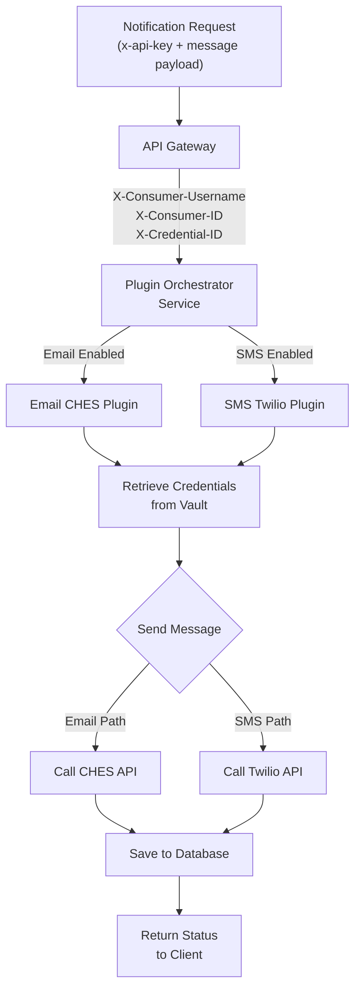
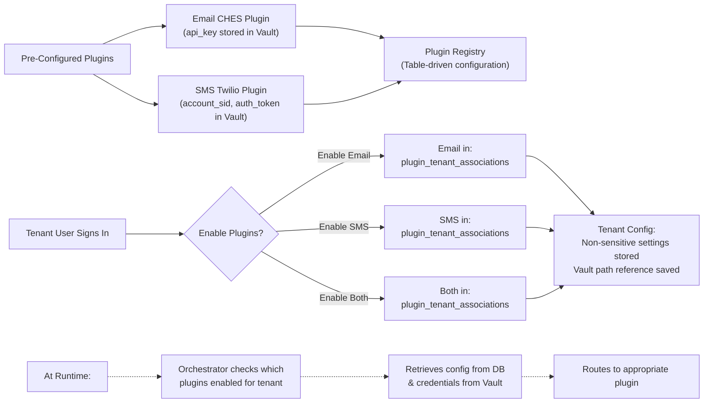

# Notification Plugin Architecture

## Overview

Provide built-in notification plugins (Email, SMS) that are pre-configured to connect to a default
email and sms provider (ches and twilio?) such that when users send notifications via Notify,
plugins are used to define how to send the notifications, and where required credentials are stored.
The plugins define what users need to supply, and validation rules that need to pass when
notifications are sent. This pattern will allow future development of plugins by external developers
by following the same plugin structure.

## Design Principles

- **Configuration-First**: Pre-Built plugins for email and sms
- **Tenant-Scoped**: Plugins are enabled per-tenant with independent configurations
- **Vault-Backed Secrets**: All sensitive credentials (SMTP passwords, API tokens, etc.) stored in
  HashiCorp Vault, never in database. Backend retrieves credentials on-demand when needed.

## Architecture Overview

### 1. Sending Notifications (Happy Path)



### 2. Plugin Configuration (Tenant Enablement)



**Note:** This diagram shows the default plugins for Phase 1 (Email CHES and SMS Twilio). Additional
pre-configured plugins may be added in the future. The Plugin Registry is a simple table in the
Notify database containing plugin metadata (id, name, type, configSchema, etc.).

## Core Components

### 1. Plugin Implementation (Internal)

Each built-in plugin is a service implementation handling a specific notification type.

```typescript
// Internal interface - not exposed to external developers (for now)
interface INotificationPlugin {
  // Plugin metadata
  id: string // Unique identifier (e.g., 'email-smtp')
  name: string // Display name (e.g., 'SMTP Email')
  type: NotificationType // 'email' | 'sms' | 'push' | 'webhook'
  version: string // Plugin version

  // Expected configuration shape (varies per plugin)
  configSchema: {
    fields: ConfigField[] // Name, type, validation rules
    required: string[] // Required field names
  }

  // Core functionality
  send(
    message: NotificationMessage,
    recipient: NotificationRecipient,
    config: Record<string, any>,
    metadata: NotificationMetadata,
  ): Promise<NotificationResult>

  // Health check
  healthCheck?(config): Promise<HealthCheckResult>
}
```

**Phase 1 Implementations:**

- Email via CHES (BC Gov's email service)
- SMS via Twilio

### 1. Plugin Config Service

- Manages plugin configurations per tenant
- Validates configuration before storing
- Tracks which plugins are enabled for each tenant
- Coordinates credential storage with HashiCorp Vault

**Responsibilities:**

- Save/retrieve non-sensitive plugin configs from database
- Store/retrieve sensitive credentials from HashiCorp Vault
- Enable/disable plugins per tenant
- Validate plugin configuration
- Maintain vault path references in database

### 2. Notification Orchestrator Service

- Receives send requests from tenant user
- Determines which plugin to use
- Retrieves plugin configuration for tenant
- Routes to correct plugin

**Flow:**

To be created

## Database Schema

### Plugins Table

```sql
CREATE TABLE plugins (
  id SERIAL PRIMARY KEY,
  plugin_id VARCHAR(255) UNIQUE NOT NULL,     -- 'email-smtp', 'sms-twilio'
  name VARCHAR(255) NOT NULL,                  -- 'SMTP Email'
  type VARCHAR(50) NOT NULL,                   -- 'email', 'sms', 'push'
  version VARCHAR(50) NOT NULL,                -- '1.0.0'
  description TEXT,
  config_schema JSONB NOT NULL,                -- ConfigField[] with validation rules
  status VARCHAR(50) NOT NULL,                 -- 'active', 'deprecated', 'disabled'
  service_url VARCHAR(500),                    -- For multi-service plugins
  created_at TIMESTAMP DEFAULT NOW(),
  updated_at TIMESTAMP DEFAULT NOW(),
  owner VARCHAR(255),                          -- E.g., 'bc-gov', 'external-team'
  documentation_url VARCHAR(500)
);
```

**Example Entries:**

```sql
-- Email CHES Plugin
INSERT INTO plugins (plugin_id, name, type, version, description, config_schema, status, owner, documentation_url)
VALUES (
  'email-ches',
  'Email via CHES',
  'email',
  '1.0.0',
  'Send emails through BC Gov Common Hosted Email Service',
  '{
    "fields": [
      {
        "name": "ches_api_endpoint",
        "type": "string",
        "label": "CHES API Endpoint",
        "required": true
      }
    ],
    "required": ["ches_api_endpoint"]
  }',
  'active',
  'bc-gov',
  'https://developer.gov.bc.ca/CHES'
);

-- SMS Twilio Plugin
INSERT INTO plugins (plugin_id, name, type, version, description, config_schema, status, owner, documentation_url)
VALUES (
  'sms-twilio',
  'SMS via Twilio',
  'sms',
  '1.0.0',
  'Send SMS messages through Twilio',
  '{
    "fields": [
      {
        "name": "twilio_from_number",
        "type": "string",
        "label": "Twilio From Number",
        "required": true,
        "validation": { "pattern": "^\\+[0-9]{1,15}$" }
      }
    ],
    "required": ["twilio_from_number"]
  }',
  'active',
  'bc-gov',
  'https://www.twilio.com/docs/sms'
);
```

### Plugin Tenant Associations Table

```sql
CREATE TABLE plugin_tenant_associations (
  id SERIAL PRIMARY KEY,
  tenant_id BIGINT NOT NULL REFERENCES tenants(id),
  plugin_id BIGINT NOT NULL REFERENCES plugins(id),
  enabled BOOLEAN DEFAULT true,
  configuration JSONB NOT NULL,                -- Non-sensitive config (field names, ports, etc)
  vault_path VARCHAR(500),                    -- Path in vault for sensitive credentials
  created_at TIMESTAMP DEFAULT NOW(),
  updated_at TIMESTAMP DEFAULT NOW(),
  UNIQUE(tenant_id, plugin_id)
);
```

### Tenant API Endpoints (for using plugins)

#### Send Notification (via Orchestrator)

```
POST /api/v1/notifications/send
Headers: Authorization: x-api-key <tenant-key>
Body:
{
  "type": "email",           // or "sms"
  "recipient": "user@example.com",
  "subject": "Hello",
  "body": "Message content",
  "pluginId": "email-smtp"   // Optional - uses default if omitted
}
Response:
{
  "id": "notif_1234567890",
  "status": "sent",
  "externalId": "...",
  "timestamp": "2026-04-01T..."
}
```

Note, that the API gateway intercepts these requests and passes them to the Notify apis.
