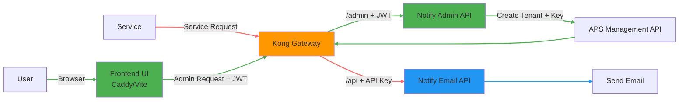
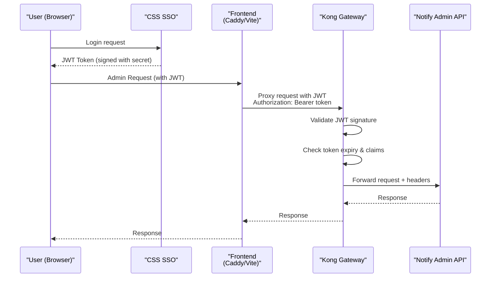
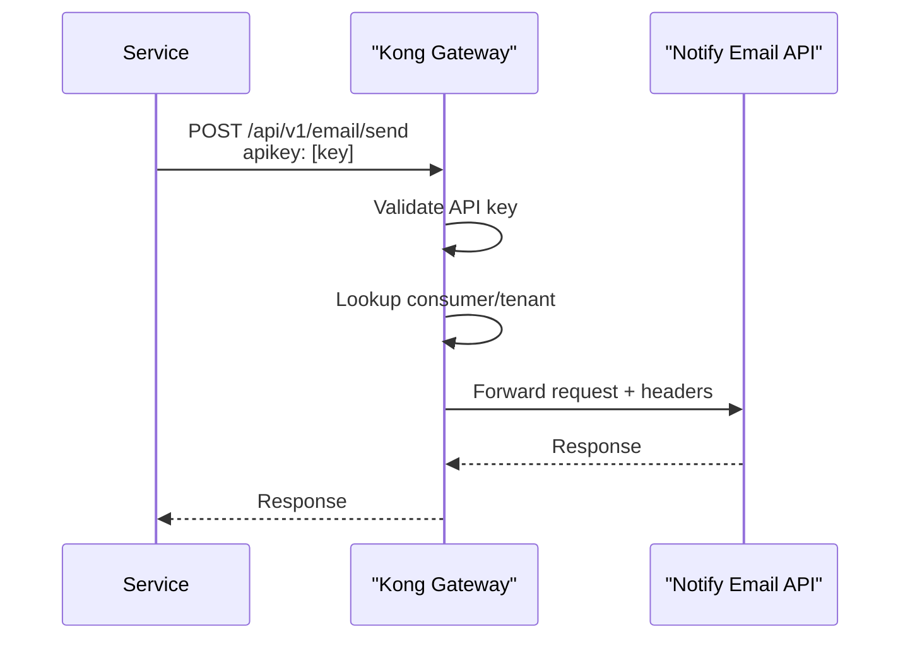
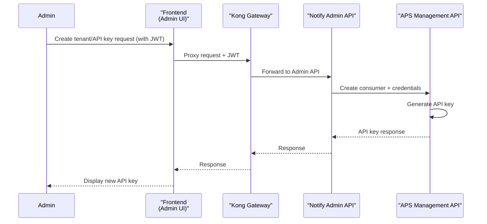
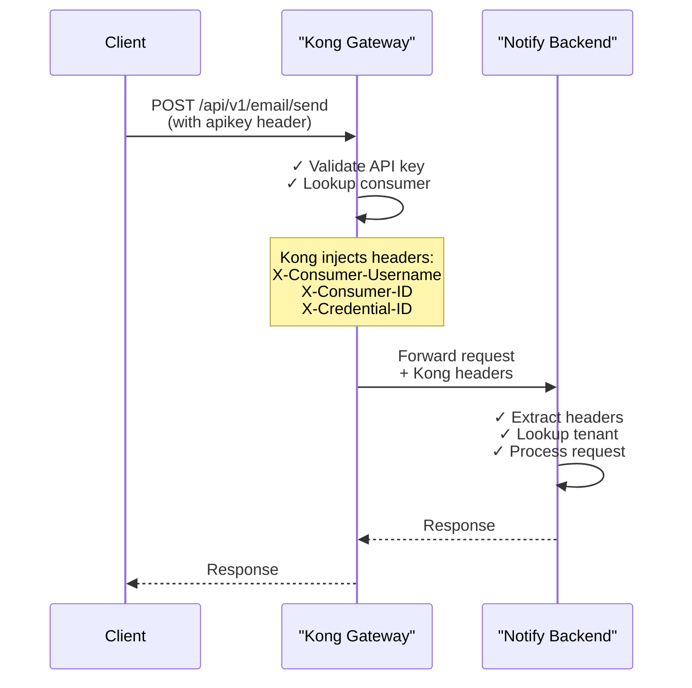

# Notify API – Gateway & API Key Design

## 1. Overview

We are building a Notify service that allows tenants to send emails/sms/messages/etc. via an API.

TBD - CSTAR - Need to understand this. Is it running? Can we use it? Is it effectively the APS
Gateway? Dig in.

Authentication is enforced by the API Gateway, but:

> The Notify system is responsible for creating and managing API keys via API Gatewaygwa (not
> directly via Kong). Do not store keys.

### Simple Flow



### Key Points

- **Frontend** (Caddy/Vite) is the entry point for users
- Frontend makes requests to **Kong** (the only API entry point)
- **Two authentication methods**:
  - **JWT** (for frontend/users): Users authenticate with CSS SSO → receive JWT → frontend includes
    in Authorization header
  - **API Keys** (for services): Service-to-service authentication for admin tools
- Kong validates credentials and injects tenant headers
- Admin API creates API keys via **APS Management API**
- Notify API processes email requests
- Backend services are **not publicly accessible**

---

## 2. Architecture Review (Detailed View)

### System Components

| Component          | Responsibility                                    |
| ------------------ | ------------------------------------------------- |
| Kong Gateway       | Auth (JWT + API Key), routing, identity injection |
| Kong JWT Plugin    | Validates JWT signatures and claims               |
| Kong Key-Auth      | Validates API keys                                |
| APS Management API | Consumer + credential management                  |
| Frontend UI        | Admin interface (authenticates via JWT)           |
| Notify API         | Core email functionality                          |
| Notify Admin API   | Tenant + API key management                       |
| CSS / Keycloak     | OAuth / SSO (issues JWT tokens)                   |

---

## Detailed Flow

### User/Frontend Flow (JWT Authentication)



### Service/Email Flow (API Key Authentication)



### Credential Management Flow



---

## Kong Authentication Plugins

Kong uses **two authentication plugins** to handle both authentication flows:

### 1. JWT Plugin (for User/Frontend Auth)

The **JWT plugin** validates JSON Web Tokens issued by your OAuth provider (CSS SSO).

**How it works:**

1. User logs in via CSS → receives signed JWT
2. Frontend includes JWT in `Authorization: Bearer <token>` header
3. Kong JWT plugin validates:
   - JWT signature (using configured secret)
   - Token expiration (`exp` claim)
   - Issuer claim (`iss`) matches a registered consumer
4. Kong injects headers and forwards to backend

**Kong Configuration:**

```yaml
# JWT Plugin on Kong Service
name: jwt
config:
  key_claim_name: iss # Claims to look up consumer
  secret_is_base64: false # Secret format
```

**Token Structure:**

```json
{
  "alg": "HS256",
  "typ": "JWT"
}
{
  "iss": "test-tenant-a",      # Consumer identifier
  "sub": "user-123",            # Subject (user ID)
  "iat": 1234567890,            # Issued at
  "exp": 1234571490,            # Expires (1 hour)
  "tenant_id": "tenant-a",      # Custom claim
  "user_id": "user-123",        # Custom claim
  "email": "user@example.com"   # Custom claim
}
```

### 2. Key-Auth Plugin (for Service/Admin Auth)

The **key-auth plugin** validates static API keys for service-to-service communication.

**How it works:**

1. Service/admin tool includes API key in `apikey` header
2. Kong key-auth plugin validates:
   - Key exists and is active
   - Key belongs to a valid consumer
3. Kong injects headers and forwards to backend

**Request Format:**

```http
GET /api/v1/admin/tenants
apikey: test-api-key-a-12345678901234567890
```

---

## Kong Plugin Setup & Configuration

Kong requires two authentication plugins to be installed and configured on routes:

### Plugin Installation

Both plugins come built-in with Kong:

- `jwt` - JSON Web Token authentication
- `key-auth` - Static API key authentication

No additional installation needed; they're enabled via configuration.

### Route-Specific Plugin Configuration

#### Admin Route (`/api/v1/admin`)

**Route Configuration:**

```
Name: notify-admin-route
Paths: /api/v1/admin
Strip Path: false
Service: notify (backend:3000)
```

**JWT Plugin:**

```yaml
name: jwt
config:
  key_claim_name: iss # Use 'iss' claim to identify Kong consumer
  secret_is_base64: false # Secrets are plaintext
  algorithms:
    - HS256 # Support HMAC-SHA256 signed tokens
  claims_to_verify:
    - exp # Verify token expiration
```

#### Email Route (`/api/v1/email`)

**Route Configuration:**

```
Name: notify-email-route
Paths: /api/v1/email
Strip Path: false
Service: notify (backend:3000)
```

**Key-Auth Plugin:**

```yaml
name: key-auth
config:
  key_names:
    - apikey # Header name for API key (clients send this)
  key_in_body: false # Only accept in headers (not request body)
  hide_credentials: true # IMPORTANT: Strip API key from upstream headers
```

**Request Flow:**

1. Client sends: `apikey: test-api-key-a-12345678901234567890`
2. Kong validates the API key
3. Kong **strips the `apikey` header** (because `hide_credentials: true`)
4. Kong injects identity headers for backend:
   - `X-Consumer-Username: test-tenant-a`
   - `X-Consumer-ID: <kong-uuid>`
   - `X-Credential-ID: <key-id>`
5. Backend receives request WITHOUT the API key

### Consumer & Credential Setup

For each tenant, create:

1. **Kong Consumer** (represents a tenant/service)

   ```
   username: test-tenant-a
   custom_id: tenant-a
   ```

2. **JWT Credentials** (for JWT authentication)

   ```
   key: test-tenant-a           # Must match JWT 'iss' claim
   secret: <secret-key>         # Used by issuer to sign JWT
   ```

3. **Key-Auth Credentials** (for API key authentication)
   ```
   key: test-api-key-a-12345678901234567890
   ```

### Security Considerations

- **JWT Secret**: Should be shared only with the SSL issuer (CSS/Keycloak), not stored in Kong
- **API Keys**: Generated by APS, never reused, rotated regularly
- **Claims Validation**: Kong verifies token expiration and issuer on every request
- **Header Injection**: Kong adds `X-Consumer-Username`, `X-Consumer-ID` after validation

---

## Security

We do not expose backend APIs publicly.

We also do not proxy directly from frontend to backend, as this would allow bypassing Kong.

Instead, Caddy proxies all requests to `https://coco-notify-gateway.dev.api.gov.bc.ca/`

### Correct Pattern

Frontend → Kong → Backend

Kong is the **only enforcement layer** for authentication.

---

## Authentication Methods

### JWT Method (User/Frontend)

- **Use case**: End-user applications, browser-based clients
- **Token source**: CSS SSO / Identity provider
- **Header**: `Authorization: Bearer <jwt_token>`
- **Validation**: Signature verification + expiration check
- **Duration**: Typically 1 hour (can be configured)
- **Storage**: Stored client-side (localStorage/sessionStorage)

### API Key Method (Service/Admin)

- **Use case**: Service-to-service, admin tools, backend operations
- **Key source**: Generated via APS Management API
- **Header**: `apikey: <api_key_value>`
- **Validation**: Key lookup + active status check
- **Duration**: Long-lived (no automatic expiration)
- **Rotation**: Manual via APS API

---

## API Key & Credential Management

- API keys and JWT credentials are stored in **Kong (via APS)**
- Notify should not store secrets - only metadata (tenant, credential ID)
- Both authentication methods are managed through the APS Management API

### API Key Flow

1. Admin API receives request to create API key
2. Admin API authenticates (either via JWT or existing API key)
3. Admin API uses **service account** to call APS
4. APS:
   - Creates consumer/tenant (if needed)
   - Generates API key
5. API key returned **once** to user
6. Notify stores metadata only

### JWT Setup

1. Kong JWT plugin is configured with the issuer secret
2. Users authenticate with CSS SSO and receive JWT
3. Tokens are validated by Kong on each request
4. No manual management needed - relies on SSO token issuance

---

## Network Isolation

Backend services are **not publicly accessible**.

- No public route to:
  - Notify API
  - Admin API
- Only Kong is exposed externally

### Network Policy

Restrict traffic so that only Kong can communicate with backend services.

---

## Frontend Proxy (Vite / Caddy)

Frontend should **NOT proxy directly to backend services**.

### Wrong

Frontend → Notify API (bypasses Kong)

### Correct

Frontend → Kong → Backend

---

## Identity Propagation

Kong injects identity headers **after validating the API key**. These headers allow the backend to
identify and track the authenticated consumer.

### Kong Header Injection Flow



### Kong Headers Added to Request

After successful API key validation, Kong adds:

| Header                | Example Value                          | Purpose                           |
| --------------------- | -------------------------------------- | --------------------------------- |
| `X-Consumer-Username` | `bchealth`                             | Tenant identifier (Kong consumer) |
| `X-Consumer-ID`       | `550e8400-e29b-41d4-a716-446655440000` | Kong's internal UUID for consumer |
| `X-Credential-ID`     | `key-123-abc`                          | The specific API key ID           |

### Backend Usage

Notify API uses these headers to:

- **Authenticate**: Confirm the API key was validated by Kong
- **Identify tenant**: Look up tenant in database by `X-Consumer-Username`
- **Track requests**: Log both DB ID (internal) and Kong ID (gateway-level audit)
- **Apply authorization**: Ensure tenant can perform the requested action

---

## Authentication Modes

| Mode               | Use Case         |
| ------------------ | ---------------- |
| API Key            | External tenants |
| Client Credentials | System-to-system |
| SSO (OIDC)         | Browser/admin UI |

---

## Responsibilities Breakdown

### Kong Gateway

- Enforces authentication
- Validates API keys and JWTs
- Routes traffic
- Injects identity headers

---

### APS Management API

- Manages consumers (tenants)
- Issues API keys (credentials)

---

### Notify API

- Sends messages
- Resolves tenant via headers
- Applies business logic
- **Does NOT validate API keys**

---

### Notify Admin API

- Authenticates users
- Calls APS using service account
- Creates tenants + API keys
- Stores metadata

---

## Deployment Notes

Each environment (dev/test/prod):

- Has its own gateway config
- Uses separate CSS / Keycloak clients
- Uses separate APS credentials
- Uses internal service URLs

---

## Key Decisions

- API key management handled via APS (not direct Kong Admin API)
- Kong is the single enforcement layer
- Backend services are not publicly accessible
- Authentication split by route:
  - `/api` → API key
  - `/admin` → OIDC

---

## Next Steps

1. Confirm APS endpoints for consumer + credential management
2. Configure service account (client credentials)
3. Point API Gateway to internal backend services
4. Remove public backend routes
5. Update frontend proxy to use gateway
6. Implement Admin API integration with APS
7. Validate end-to-end flow

---

## Managing APS Resources

## Overview

APS (API Program Services) uses a `GraphQL API` to manage Kong resources such as:

- Consumers (tenants)
- API Keys (credentials)
- Gateway associations (namespaces)

Endpoint:

https://api.gov.bc.ca/gql/api

I think we create a service account to execute mutations here

---

## Key Concepts

### Consumer = Tenant

Represents a tenant in your system.

### Namespace

Represents your gateway context.

Consumers must be linked to a namespace before they can be used.

---

## Required Flow

### 1. Create Consumer

I'm using devtools on my browser to figure this out, it's probably documented somewhere though

Expected mutation:

```graphql
mutation CreateConsumer($input: CreateConsumerInput!) {
  createConsumer(input: $input) {
    id
    username
  }
}
```

---

### 2. Link Consumer to Namespace

For now, the dev namespace it ns.gw-fe8c5. This was created when we created the gateway. This may
change as I repeat these steps.

At the very least, test/prod will have different namespaces (I haven't created these yet)

```graphql
mutation LinkConsumerToNamespace($username: String!) {
  linkConsumerToNamespace(username: $username)
}
```

Variables:

```json
{
  "username": "tenant-name"
}
```

---

### 3. Create API Key

(Not yet captured — must be retrieved from DevTools)

Expected mutation:

```graphql
mutation CreateCredential($consumerId: ID!) {
  createCredential(consumerId: $consumerId) {
    id
    key
  }
}
```

---

## Authentication

All requests require a service account token:

Authorization: Bearer <token>

---

## NestJS Integration Pattern

### GraphQL Helper

```ts
async gqlRequest(query: string, variables: any) {
  const token = await this.getAccessToken();

  return this.httpService.axiosRef.post(
    'https://api.gov.bc.ca/gql/api',
    { query, variables },
    {
      headers: {
        Authorization: `Bearer ${token}`,
        'Content-Type': 'application/json',
      },
    },
  );
}
```

---

### Example: Link Consumer

```ts
async linkConsumer(username: string) {
  return this.gqlRequest(
    `
    mutation LinkConsumerToNamespace($username: String!) {
      linkConsumerToNamespace(username: $username)
    }
    `,
    { username }
  );
}
```

---

## Important Notes

- Do NOT call Kong Admin APIs directly
- All management goes through APS GraphQL
- Consumers must be linked to namespace before use
- Do NOT store API keys in your database

---

## Next Steps

Capture the following from DevTools:

- createConsumer mutation
- createCredential mutation

These are required to fully automate tenant onboarding.

## Final Takeaway

- Kong = enforcement layer
- APS = management layer
- Notify = business logic
- Admin API = bridge between Notify and APS
