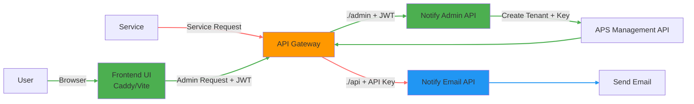
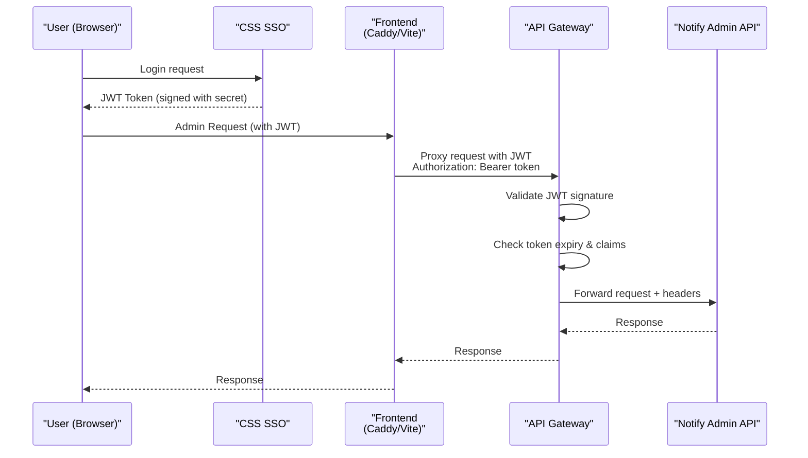
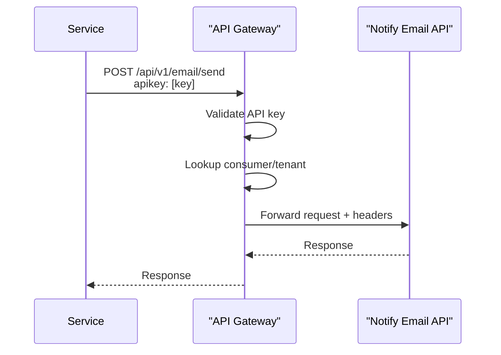
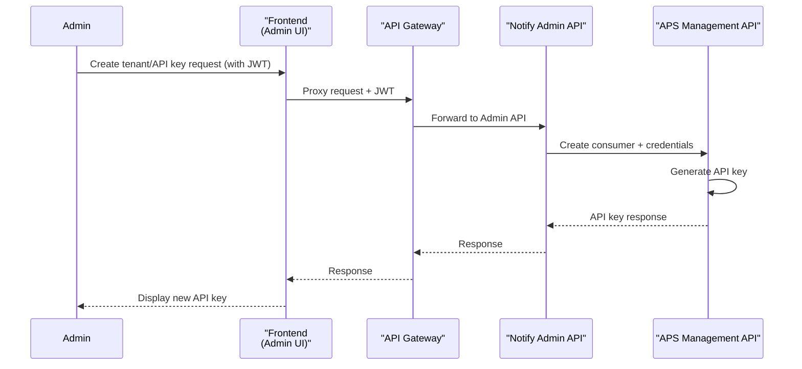
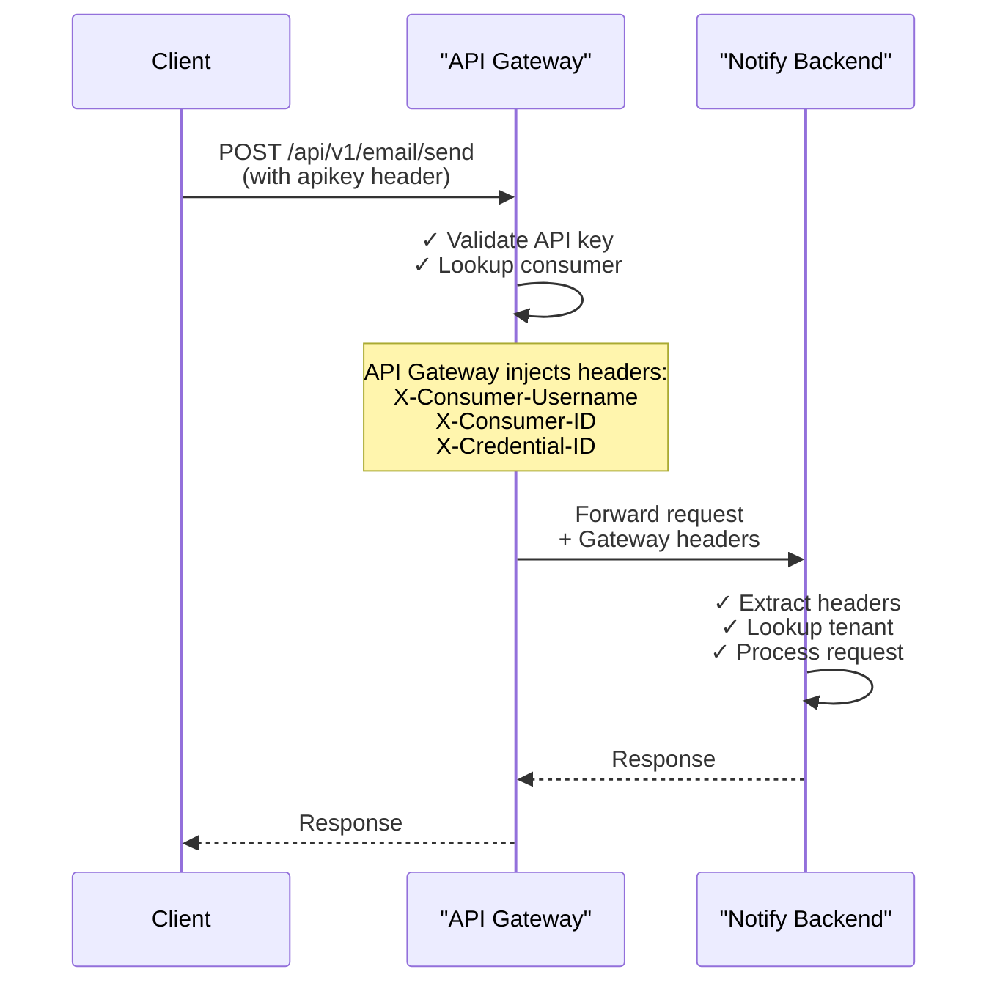

# Notify API – Gateway & API Key Design v3

## 1. Overview

We are building a Notify service that allows tenants to send emails/sms/messages/etc. via an API. We
are also building an admin component that allows users to create templates for their messages, as
well as other admin tasks.

TBD - CSTAR - Need to understand this. Is it running? Can we use it? Is it effectively the APS
Gateway? Dig in.

Authentication is enforced by the API Gateway. The API Gateway is what validates API Keys, it also
validates JWTs (so we don't need to do that a second time on the backend). The API Gateway will only
relay requets back to Notify if they're valid (e.g. the API Key is valid, or the JWT is valid for a
known identify provider)

We don't store keys. That said, we likely want to store the following, which is injected by the API
Gateway:

- `X-Consumer-Username: test-tenant-a`
- `X-Consumer-ID: <tenant-uuid>`
- `X-Credential-ID: <key-id>`

These three pieces of information should allow us to identify the tenant of all requests, the user
of all requests, and (if an API key is supplied) the API key _ID_ (not the api key itself).

Need to figure out how CSTAR comes into play here. If I understand Chris correctly, we will use
CSTAR for tenant and API key management. However, Jason mentioned that CSTAR isn't available, and
may not be until "later". So I'll need to better understand this.

### Simple Flow

Quick and dirty version: we'll want to route everything throguh the API gateway. They validate api
keys, and they validate JWTs (we can use the api key plugin, and jwt plugin for these two purposes).
The API gateway proxies requests to Notify. We create a network policy in OpenShift that only
accepts traffic to the backend from the API Gateway. In this way, we know that any requests to the
backend are valid requests.



### Key Points

- **Frontend** (Caddy/Vite) is the entry point for users
- Frontend makes requests to the api gateway (the only API entry point)
- Two authentication methods\*
  - JWT (for frontend/administrators): Users authenticate with CSS SSO → receive JWT → frontend
    includes in Authorization header -> send to api gateway -> api gateway validates JWT -> request
    is relayed to backend
  - API Keys (for services): Service-to-service authentication for emails
- API Gateway validates credentials and injects tenant headers
- Admin API creates API keys (via APS Management API? CSTAR?)
- Notify API processes email requests
- Backend services are not publicly accessible (again, only route to the backend is via the API
  Gateway). This results in a trusted private route that only the API Gateway can access. No need to
  double-validate JWTs or API Keys

---

## 2. Architecture Review (Detailed View)

### System Components

| Component          | Responsibility                                      |
| ------------------ | --------------------------------------------------- |
| API Gateway        | Auth (JWT + API Key), routing, identity injection.  |
| JWT Plugin.        | Validates JWT signatures and claims                 |
| Key-Auth           | Validates API keys                                  |
| APS Management API | Consumer + credential management (maybe use CSTAR?) |
| Frontend UI        | Admin interface (authenticates via JWT)             |
| Notify API         | Core messaging functionality                        |
| Notify Admin API   | Tenant + API key management                         |
| CSS / Keycloak     | OAuth / SSO (issues JWT tokens)                     |

---

## Detailed Flow

### User/Frontend Flow (JWT Authentication)

Work in progress, may need to use a service account to connect the Notify backend to the API
Gateway. But we also want to maintain user information of those making the requests.



### Service/Email Flow (API Key Authentication)



### Credential Management Flow



---

## API Gateway Authentication Plugins

API Gateway uses **two authentication plugins** to handle both authentication flows:

### 1. JWT Plugin (for User/Frontend Auth)

The **JWT plugin** validates JSON Web Tokens issued by your OAuth provider (CSS SSO).

**How it works:**

1. User logs in via CSS → receives signed JWT
2. Frontend includes JWT in `Authorization: Bearer <token>` header
3. API Gateway JWT plugin validates:
   - JWT signature (using configured secret)
   - Token expiration (`exp` claim)
   - Issuer claim (`iss`) matches a registered consumer
4. API Gateway injects headers and forwards to backend

### 2. Key-Auth Plugin (for Service/Admin Auth)

The **key-auth plugin** validates static API keys for service-to-service communication.

**How it works:**

1. Service/admin tool includes API key in `x-api-key` header
2. API Gateway key-auth plugin validates:
   - Key exists and is active
   - Key belongs to a valid consumer
3. API Gateway injects headers and forwards to backend

**Request Format:**

```http
GET /api/v1/admin/tenants
x-api-key: test-api-key-a-12345678901234567890
```

---

## API Gateway Plugin Setup & Configuration

API Gateway requires two authentication plugins to be installed and configured on routes. This is
setup via the files in .api-gateway (need to integrate this into the pipeline so that dev/test/prod
use the correct gateways).

### Plugin Installation

- `jwt` - JSON Web Token authentication
- `key-auth` - Static API key authentication

This is done, I think, but need to test it. The service is named `coco-notify-backend-dev` in
https://api.gov.bc.ca/manager/services

### Route-Specific Plugin Configuration

Work in progress. Need to document the gateway configuration file here that I created. I'll document
once I verify that the gateway services work correctly.

## Authentication Methods

### JWT Method (User/Frontend)

- **Use case**: Users login to administer their templates in Notify
- **Token source**: CSS SSO? Other identify providers?
- **Validation**: API Gateway
- **Storage**: Stored client-side (localStorage/sessionStorage)

### API Key Method (Service/Admin)

- **Use case**: Service-to-service, send emails/messages/etc with an api key
- **Key source**: Generated via APS Management API (though we'll call that from Notify)
- **Header**: `x-api-key: <api_key_value>`
- **Validation**: API Gateway

---

### API Key Flow

1. Admin API receives request to create API key
2. Admin API authenticates (either via JWT or existing API key)
3. Admin API uses a service account (maybe) to call APS (or CSTAR?)
4. APS:
   - Creates consumer/tenant (if needed)
   - Generates API key
5. API key returned to user, with the usual "Make sure you store this securely, we won't show it
   again to you" message
6. Notify stores metadata only

### JWT Setup

1. API Gateway JWT plugin is configured with the issuer secret
2. Users authenticate with CSS SSO and receive JWT
3. Tokens are validated by API Gateway on each request
4. No manual management needed - relies on SSO token issuance

---

## Network Isolation

Backend services are not publicly accessible.

- No public route to:
  - Notify API
  - Admin API
- Only API Gateway url is exposed externally

### Network Policy

Restrict traffic so that only the API Gateway can communicate with backend services.

---

## Frontend Proxy (Vite / Caddy)

Frontend should proxy all requests through the API Gateway since they're setup to validate API Keys
and JWTs. Sounds wrong on the surface because this could overburden the API Gateway, but this is a
standard pattern.

---

## Identity Propagation

API Gateway injects identity headers after validating the API key. These headers allow the backend
to identify and track the authenticated consumer.

### API Gateway Header Injection Flow



### API Gateway Headers Added to Request

After successful API key validation, API Gateway adds:

| Header                | Example Value                          | Purpose                                  |
| --------------------- | -------------------------------------- | ---------------------------------------- |
| `X-Consumer-Username` | `bchealth`                             | Tenant identifier (API Gateway consumer) |
| `X-Consumer-ID`       | `550e8400-e29b-41d4-a716-446655440000` | API Gateway's internal UUID for consumer |
| `X-Credential-ID`     | `key-123-abc`                          | The specific API key ID                  |

### Backend Usage

Notify API uses these headers to:

- **Authenticate**: Confirm the API key was validated by API Gateway
- **Identify tenant**: Look up tenant in database by `X-Consumer-Username`
- **Track requests**: Log both DB ID (internal) and API Gateway ID (gateway-level audit)
- **Apply authorization**: Ensure tenant can perform the requested action

---

## Responsibilities Breakdown

### API Gateway

- Enforces authentication
- Validates API keys and JWTs
- Routes traffic
- Injects identity headers

---

### APS Management API (or CSTAR)

- Manages consumers (tenants)
- Issues API keys (credentials)

---

### Notify API

- Sends messages
- Resolves tenant via headers
- Applies business logic
- Does NOT validate API keys or JWT tokens

---

### Notify Admin Portal

- Authenticates users
- Calls APS using service account
- Creates tenants + API keys via API Gateway or CSTAR
- Stores metadata

---

## Deployment Notes

Work in progress, need to chat with Nick about pipeline changes that will be needed

---

## Managing APS Resources

## Overview

Use GraphQL API to manage API Gateway resources such as:

- Consumers (tenants)
- API Keys (credentials)
- Gateway associations (namespaces)

Endpoint:

https://api.gov.bc.ca/gql/api

I think we create a service account to execute mutations here, but again, need to think more about
this.

---

## Key Concepts

### Consumer = Tenant

Represents a tenant in Notify.

---

## Required Flow

### 1. Create Consumer

I'm using devtools on my browser to figure this out on the
https://api.gov.bc.ca/manager/gateways/detail site, it's probably documented somewhere though (but I
can't find it)

Expected mutation:

```graphql
mutation CreateConsumer($input: CreateConsumerInput!) {
  createConsumer(input: $input) {
    id
    username
  }
}
```

---

### 2. Link Consumer to Namespace

For now, the dev namespace it ns.gw-fe8c5. This was created when we created the gateway. This may
change as I repeat these steps.

At the very least, test/prod will have different namespaces (I haven't created these yet)

```graphql
mutation LinkConsumerToNamespace($username: String!) {
  linkConsumerToNamespace(username: $username)
}
```

Variables:

```json
{
  "username": "tenant-name"
}
```

---

### 3. Create API Key

(Not yet captured — must be retrieved from DevTools)

Expected mutation:

```graphql
mutation CreateCredential($consumerId: ID!) {
  createCredential(consumerId: $consumerId) {
    id
    key
  }
}
```

---

## Authentication

All requests require a service account token:

Authorization: Bearer <token>

---

## NestJS Integration Pattern

### GraphQL Helper

Create an axios helper that will call the graphql endpoints

e.g. to create tenants, link users to tenants, generate api keys (?)

All done in the backend, axios calls using GraphQL to the API Gateway
