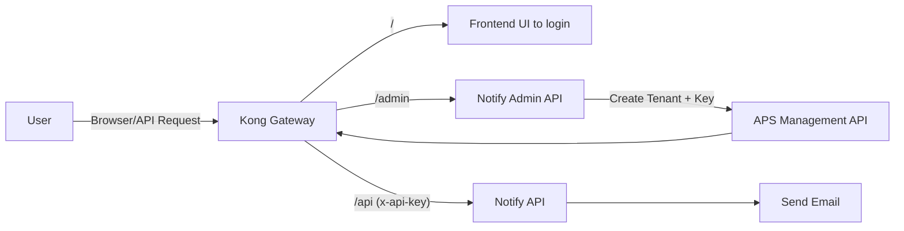
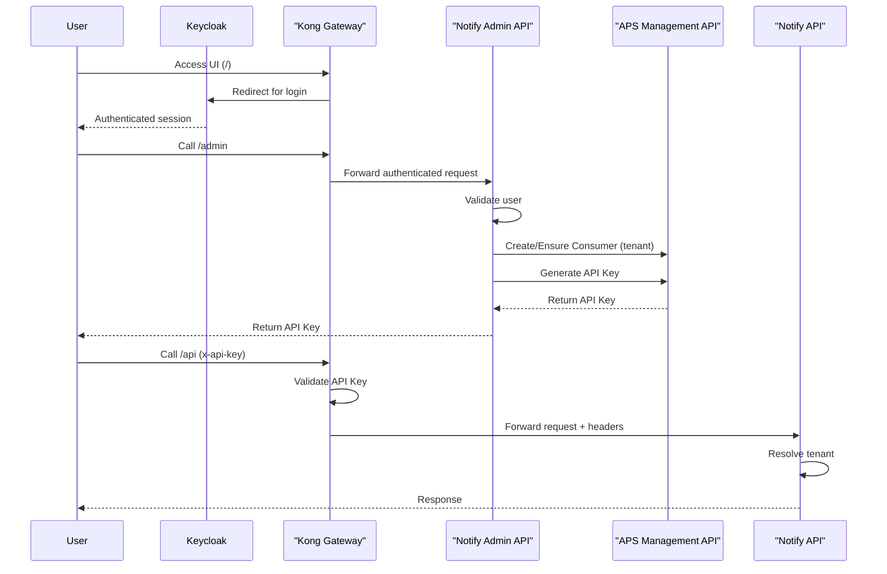

# Notify API – Gateway & API Key Design

## 1. Overview

We are building a Notify service that allows tenants to send emails/sms/messages/etc. via an API.

Authentication is enforced by the API Gateway, but:

> The Notify system is responsible for creating and managing API keys via API Gatewaygwa (not
> directly via Kong).

### Simple Flow



### Key Points

- Kong is the **only entry point**
- Admin API creates API keys via **APS Management API**
- Notify API processes requests
- Tenants are identified via headers injected by Kong
- Backend services are **not publicly accessible**

---

## 2. Architecture Review (Detailed View)

### System Components

| Component          | Responsibility                    |
| ------------------ | --------------------------------- |
| Kong Gateway (APS) | Auth, routing, identity injection |
| APS Management API | Consumer + credential management  |
| Frontend UI        | Admin interface                   |
| Notify API         | Core email functionality          |
| Notify Admin API   | Tenant + API key management       |
| CSS / Keycloak     | OAuth / SSO                       |

---

## Detailed Flow



---

## Security

We do not expose backend APIs publicly.

We also do not proxy directly from frontend to backend, as this would allow bypassing Kong.

Instead, Caddy proxies all requests to `https://coco-notify-gateway.dev.api.gov.bc.ca/`

### Correct Pattern

Frontend → Kong → Backend

Kong is the **only enforcement layer** for authentication.

---

## API Key Management

- API keys are stored in **Kong (via APS)**
- Notify should not store API keys, need to confirm because I think this is the datamodel
- Notify only stores metadata (tenant, credential ID, etc.)

### Flow

1. Admin API receives request to create API key
2. Admin API authenticates user (OIDC via Kong)
3. Admin API uses **service account** to call APS
4. APS:
   - Creates consumer (if needed)
   - Generates API key
5. API key returned **once** to user
6. Notify stores metadata only

---

## Network Isolation

Backend services are **not publicly accessible**.

- No public route to:
  - Notify API
  - Admin API
- Only Kong is exposed externally

### Network Policy

Restrict traffic so that only Kong can communicate with backend services.

---

## Frontend Proxy (Vite / Caddy)

Frontend should **NOT proxy directly to backend services**.

### Wrong

Frontend → Notify API (bypasses Kong)

### Correct

Frontend → Kong → Backend

---

## Identity Propagation

Kong injects identity headers:

```
x-consumer-username: tenant-abc
```

Notify API uses this to:

- Identify tenant
- Apply authorization rules
- Track usage

---

## Authentication Modes

| Mode               | Use Case         |
| ------------------ | ---------------- |
| API Key            | External tenants |
| Client Credentials | System-to-system |
| SSO (OIDC)         | Browser/admin UI |

---

## Responsibilities Breakdown

### Kong Gateway

- Enforces authentication
- Validates API keys and JWTs
- Routes traffic
- Injects identity headers

---

### APS Management API

- Manages consumers (tenants)
- Issues API keys (credentials)

---

### Notify API

- Sends messages
- Resolves tenant via headers
- Applies business logic
- **Does NOT validate API keys**

---

### Notify Admin API

- Authenticates users
- Calls APS using service account
- Creates tenants + API keys
- Stores metadata

---

## Deployment Notes

Each environment (dev/test/prod):

- Has its own gateway config
- Uses separate CSS / Keycloak clients
- Uses separate APS credentials
- Uses internal service URLs

---

## Key Decisions

- API key management handled via APS (not direct Kong Admin API)
- Kong is the single enforcement layer
- Backend services are not publicly accessible
- Authentication split by route:
  - `/api` → API key
  - `/admin` → OIDC

---

## Next Steps

1. Confirm APS endpoints for consumer + credential management
2. Configure service account (client credentials)
3. Point API Gateway to internal backend services
4. Remove public backend routes
5. Update frontend proxy to use gateway
6. Implement Admin API integration with APS
7. Validate end-to-end flow

---

## Managing APS Resources

## Overview

APS (API Program Services) uses a `GraphQL API` to manage Kong resources such as:

- Consumers (tenants)
- API Keys (credentials)
- Gateway associations (namespaces)

Endpoint:

https://api.gov.bc.ca/gql/api

I think we create a service account to execute mutations here

---

## Key Concepts

### Consumer = Tenant

Represents a tenant in your system.

### Namespace

Represents your gateway context.

Consumers must be linked to a namespace before they can be used.

---

## Required Flow

### 1. Create Consumer

I'm using devtools on my browser to figure this out, it's probably documented somewhere though

Expected mutation:

```graphql
mutation CreateConsumer($input: CreateConsumerInput!) {
  createConsumer(input: $input) {
    id
    username
  }
}
```

---

### 2. Link Consumer to Namespace

For now, the dev namespace it ns.gw-fe8c5. This was created when we created the gateway. This may
change as I repeat these steps.

At the very least, test/prod will have different namespaces (I haven't created these yet)

```graphql
mutation LinkConsumerToNamespace($username: String!) {
  linkConsumerToNamespace(username: $username)
}
```

Variables:

```json
{
  "username": "tenant-name"
}
```

---

### 3. Create API Key

(Not yet captured — must be retrieved from DevTools)

Expected mutation:

```graphql
mutation CreateCredential($consumerId: ID!) {
  createCredential(consumerId: $consumerId) {
    id
    key
  }
}
```

---

## Authentication

All requests require a service account token:

Authorization: Bearer <token>

---

## NestJS Integration Pattern

### GraphQL Helper

```ts
async gqlRequest(query: string, variables: any) {
  const token = await this.getAccessToken();

  return this.httpService.axiosRef.post(
    'https://api.gov.bc.ca/gql/api',
    { query, variables },
    {
      headers: {
        Authorization: `Bearer ${token}`,
        'Content-Type': 'application/json',
      },
    },
  );
}
```

---

### Example: Link Consumer

```ts
async linkConsumer(username: string) {
  return this.gqlRequest(
    `
    mutation LinkConsumerToNamespace($username: String!) {
      linkConsumerToNamespace(username: $username)
    }
    `,
    { username }
  );
}
```

---

## Important Notes

- Do NOT call Kong Admin APIs directly
- All management goes through APS GraphQL
- Consumers must be linked to namespace before use
- Do NOT store API keys in your database

---

## Next Steps

Capture the following from DevTools:

- createConsumer mutation
- createCredential mutation

These are required to fully automate tenant onboarding.

## Final Takeaway

- Kong = enforcement layer
- APS = management layer
- Notify = business logic
- Admin API = bridge between Notify and APS
